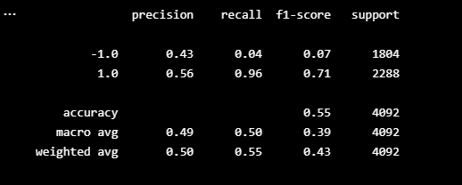
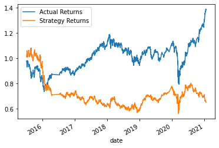
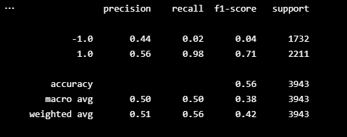
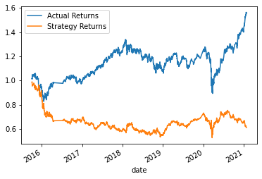
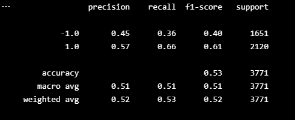
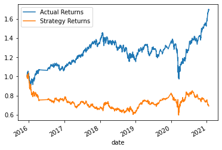
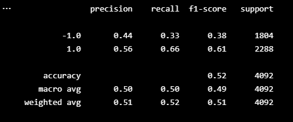
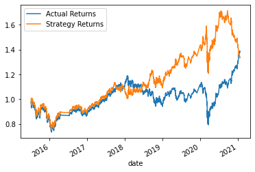

# Algo-Trading-Homework

---

## Baseline Algo: 

>

>
The baseline algorithm was largely unsuccessful, the actual returns went has high as 1.4X where as the algorithm trading retruned a negative 40% drop in money.

---

## Tune - size adjustment (6months):

>

>
In this model, I adjusted the time frame of the model by expanding the data from 3 months all the way to 6 months instead. In this model the accuracy and recall increased slightly but largely the outcome was unaffected. This model also failed at being profitable and in fact actually gave us slightly lower returns than our base model.

---

## Tune - SMA Window Adjustment:

>

>
In this model, I adjusted the SMA windows for both the short and long timeframe. I made the short window 30 days and the long window 200 days. The classification report shows that our recall dropped dramatically and the accuracy dropped slightly. This model, like the others, also provided us with negative returns. The SMA adjustment provided us very similar returns to that of the date adjustment. 

---

## Evaluate a new ML classifier:

>

>
In this model, I instead used logistic regression as a machine learning classifier. Despite having slightly lower accuracy, this model actually turned out to be profitable for the majority of it, and then coming back to breakeven toward the end. If stopped with good timing, It would have been possible to be quite profitable here.